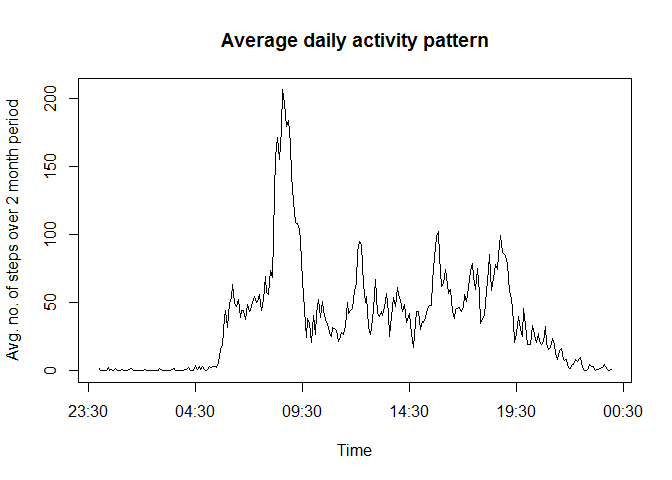

# Reproducible Research: Peer Assessment 1

## Loading required libraries

```r
library(stringr)
library(lubridate)
```


## Loading and preprocessing the data

- Assign a filename

```r
filename <- "activity/activity.csv"
```
- Read data using the read.csv() function

```r
Data <- read.csv(filename, header = TRUE)
```
- Remove all the NAs from the 'Data' and create a new data frame called Data2.

```r
Data2 <- Data[complete.cases(Data), ]
```


## What is mean total number of steps taken per day?

- Split the 'Data2' dataframe by the date as follows:

```r
spData2 <- split(Data2$steps, Data2$date)
```
- Apply sapply to determine the sum of steps taken per day as follows:

```r
sum.of.steps.per.day <- sapply(spData2, sum) 
summary(sum.of.steps.per.day)
```

```
##    Min. 1st Qu.  Median    Mean 3rd Qu.    Max. 
##       0    6778   10400    9354   12810   21190
```
- Histogram plot of total steps per day is as follows:

```r
hist(sum.of.steps.per.day)
```

 


- Mean and median of total number of steps taken per day is calculated as follows:

```r
mean.steps <- mean(sum.of.steps.per.day)
median.steps <- median(sum.of.steps.per.day)
mean.steps
```

```
## [1] 9354.23
```

```r
median.steps
```

```
## [1] 10395
```


## What is the average daily activity pattern?

- First split the 'Data2' data frame by the 'interval' variable as follows: 

```r
spData2 <- split(Data2$steps, Data2$interval)
```
- Next, calculate the mean of the steps per interval to get a daily activity pattern as follows:

```r
steps.per.interval <- sapply(spData2, mean)
```
- The following code chuck will convert the 'interval' variable into a date class (useful for plotting activity pattern)

```r
y <- as.numeric(names(steps.per.interval)) 

mins <- vector("character", length(y))
hours <- vector("character", length(y))
time <- vector("character", length(y))

for (i in 1:length(y)) {
  
  if (y[i] < 100) {
    
    mins[i] <- as.character(y[i])
    hours[i] <- "00"
    time[i] <- paste(hours[i], ":", mins[i], ":", "00", sep="")
    
    
  } else if (y[i] < 1000) {
    
    zz <- as.character(y[i])
    hours[i] <- str_sub(zz, start=1, end=1)
    mins[i] <- str_sub(zz, start=2)  
    time[i] <- paste("0", hours[i], ":", mins[i], ":", "00", sep = "")      
    
  } else {
    
    zz <- as.character(y[i])
    hours[i] <- str_sub(zz, start=1, end=2)
    mins[i] <- str_sub(zz, start=3)
    time[i] <- paste(hours[i], ":", mins[i], ":", "00", sep="")      
    
  }
  
}

Time <- strptime(time, "%H:%M:%S")
```
- Next, plot the activity pattern with interval on the x axis and the average steps in that interval on the y-axis using base plot as follows:

```r
plot(Time, steps.per.interval, type="l", main = "Average daily activity pattern", ylab = "Avg. no. of steps over 2 month period")
```

 


- Next, try to identify in which interval activity is maximum as follows: 

```r
ind <- which(steps.per.interval == max(steps.per.interval))
time_max <- names(steps.per.interval[ind])
if(nchar(time_max) == 2) {
  result <- paste("00:", time_max, sep = "")
} else if (nchar(time_max==3)) {
  result <- paste("0", str_sub(time_max, 1,1), ":", str_sub(time_max, 2), sep="")
} else {
  result <- paste(str_sub(time_max, 1,2), ":", str_sub(time_max, 3), sep="")
}
print(result)
```

```
## [1] "08:35"
```


## Imputing missing values
- Number of missing values in the dataset is evaluated as follows:

```r
Num.missing.values <- length(which(is.na(Data$steps)))
print(Num.missing.values)
```

```
## [1] 2304
```
- The strategy to fill in missing values is to use the average daily activity data. There are a fixed number of recordings at exactly the same time intervals daily. We use the following code chunk to assign the mean value at that time interval in case of a missing vaule: 

```r
for (i in 1:length(Data$steps))  {
  
    if (is.na(Data$steps[i])) {
      
        j <- length(Time)
        index <- i%%j
        
        if (index != 0) {
          
            Data$steps[i] <- steps.per.interval[index]
      
        } else {
          
            Data$steps[i] <- steps.per.interval[j]
          
        }
        
    }
  
}
```
- We can cross check if this worked by calculating number of missing values again. 

```r
length(which(is.na(Data$steps)))
```

```
## [1] 0
```


We now plot a histogram of the steps taken per day. 


```r
spData <- split(Data$steps, Data$date)
sum.of.steps.per.day <- sapply(spData, mean)
summary(sum.of.steps.per.day)
```

```
##    Min. 1st Qu.  Median    Mean 3rd Qu.    Max. 
##  0.1424 34.0900 37.3800 37.3800 44.4800 73.5900
```

```r
hist(sum.of.steps.per.day)
```

 


## Are there differences in activity patterns between weekdays and weekends?
To find this out, we first write a code chunk determining whether a given day is a weekday or a weekend. 

- The following code stores the indices of the weekdays and weekends in the data set.

```r
y <- as.Date(Data$date)
inds.wkends <- which(weekdays(y) == "Saturday" | weekdays(y) == "Sunday")
inds.wkdays <- which(weekdays(y) != "Saturday" & weekdays(y) != "Sunday")
```
- The next natural step is to create a variable 'daytype' which can assign either a 'weekday' or a 'weekend' depending on the indices computed above. The first line creates the variable. The second and third lines assigns the value.

```r
daytype <- vector("character", length(y))
daytype[inds.wkdays] = "Weekdays"
daytype[inds.wkends] = "weekends"
```
- Now we're ready to create a data frame with the above variable and append it to the original data frame by using the cbind() function. We call the new data frame Data.V2. The code is presented as follows.

```r
dayType <- data.frame(daytype = daytype)
Data.V2 <- cbind(Data, dayType)
```
- Since we need to treat weekdays and weekends separately, we coerce the 'daytime' variable to the type 'factor'. This is done as follows:

```r
Data.V2$daytype <- as.factor(Data.V2$daytype)
```
- The next piece of code is to obtain a very rough estimate to see if average steps covered is greater over the weekdays or weekends. It is a simple average of the data after splitting into two pieces - weekdays and weekends.

```r
spData3 <- split(Data.V2$steps, Data.V2$daytype)
mean.daytype <- sapply(spData3, mean)
print(mean.daytype)
```

```
## Weekdays weekends 
## 35.61058 42.36640
```

- The next part of code will check the average activity over the intervals averaged on all the days. The difference from the previously presented plot is that we treat weekdays and weekends separately. So, the natural step to proceed is to first split the entire data set into two chunks: weekdays, and weekends. Here's the code for it.

```r
spData4 <- split(Data.V2, Data.V2$daytype)
names(spData4)
```

```
## [1] "Weekdays" "weekends"
```

- So next, we assign the weekday data frame to weekd, and then split the $steps variable with the interval. An average over all the weekdays will give us the activity data per interval in the weekdays. 


```r
weekd <- spData4[[1]]
spData5 <- split(weekd$steps, weekd$interval)
avg.wd.interval <- sapply(spData5, mean) 
```

- A similar story follows for the weekends. Exactly the same steps as above for the weekends as well.

```r
weeknd <- spData4[[2]]
spData6 <- split(weeknd$steps, weeknd$interval)
avg.wnd.interval <- sapply(spData6, mean)
```

- The last and final part is to plot the data. This is done with the following code:

```r
par(mfrow = c(2,1), mar = c(2,4,2,2) + 0.1)
plot(Time, avg.wd.interval, type = "l", main = "Weekdays", cex.main = 0.9, ylim = c(0,250), ylab = "Average steps over 2 months", cex.lab = 0.7, cex.axis = 0.7, xlab = "Interval")
plot(Time, avg.wnd.interval, type = "l", main = "Weekends", cex.main= 0.9, ylim = c(0,250), ylab = "Average steps over 2 months", cex.lab = 0.7, cex.axis = 0.7, xlab = "Interval")
```

 


So, there is one apparent difference in the activity pattern between weekdays and weekends. In the weekdays, the number of steps per day peaks early in the day at about 08:30. And the rest of the day is rather low. However, over the weekends, the number of steps is more or less more evenly distributed through the middle part of the day. One possible explanation for the activity pattern in the weekdays could be travelling to the workplace or institute, which results in a peaking. While in the weekends, no more going to office. But, perhaps other personal activities are being carried out throught the day like trekking or gardening, etc, which can explain the relatively distributed activity graph.

## Note
This assignment is an almost exact resubmission of my own assignment from the previous month. I couldn't complete the course last month due to time constraints. 
